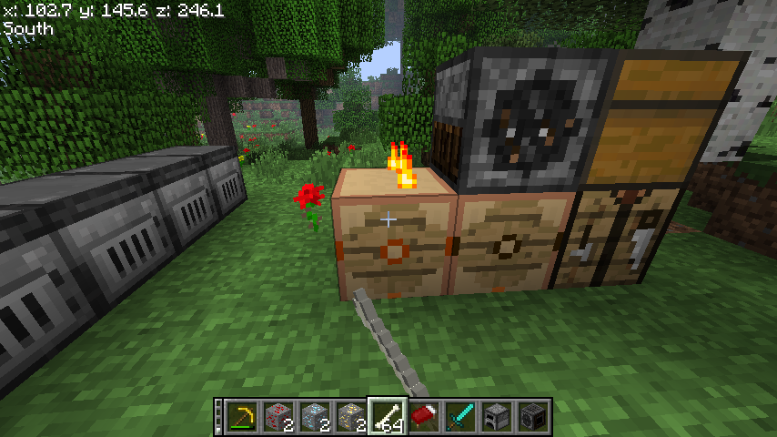
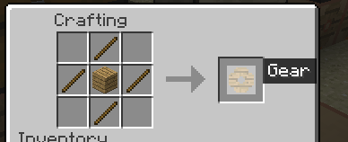
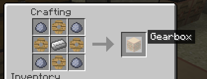
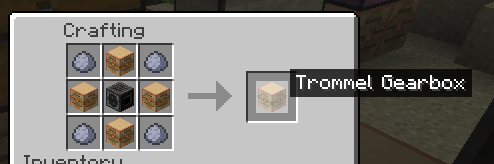
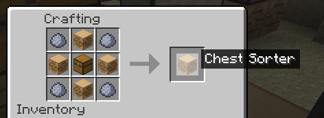

# Ancient Logistics

Ancient Logistics is a mod for [Better than Adventure](https://www.minecraftforum.net/forums/mapping-and-modding-java-edition/minecraft-mods/3106066-better-than-adventure-for-beta-1-7-3-timely) that adds a variety of new items and blocks to the game, all of which are based around the idea of logistics and automation.

built using [bta-example-mod](https://github.com/Turnip-Labs/bta-example-mod/)

### Features

- Gearboxes

Gear Item: This item is used for crafting other items.

Gearboxes: These blocks are activated with bones and activate adjacent blocks. They occasionally break a bone in your hand - based on the number of adjacent blocks. Each Gearbox can only touch one gear block directly at a time, but some gear blocks can be chained.

Gear Trommel: This block sits underneath a trommel, and if there are items to seive, this block will activate the trommel without the need for coal.

Chest Sorter: This powered block is capable of sorting attached chests. It can be linked in a row and requires the first Chest Sorter to have a chest placed on top. It is crafted using 4 gearboxes, 4 clay, and one chest, similar to TNT.

### Crafting Recipes

### Installation

Requires:
- [Better than Adventure 1.7.6.2_02](https://github.com/Better-than-Adventure/bta-download-repo/releases/tag/v1.7.6.2_02)
- [babric](https://babric.github.io/)
- [bta-halplibe v1.1.4](https://github.com/Turnip-Labs/bta-halplibe/releases/tag/v1.1.4)

Drop the jar file into the `mods` folder of your Better than Adventure installation.

If there are other mods installed, there may be item ID conflicts. If this happens, you can change the item IDs in the `config/ancientlogistics.cfg` file.