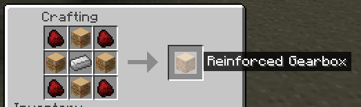
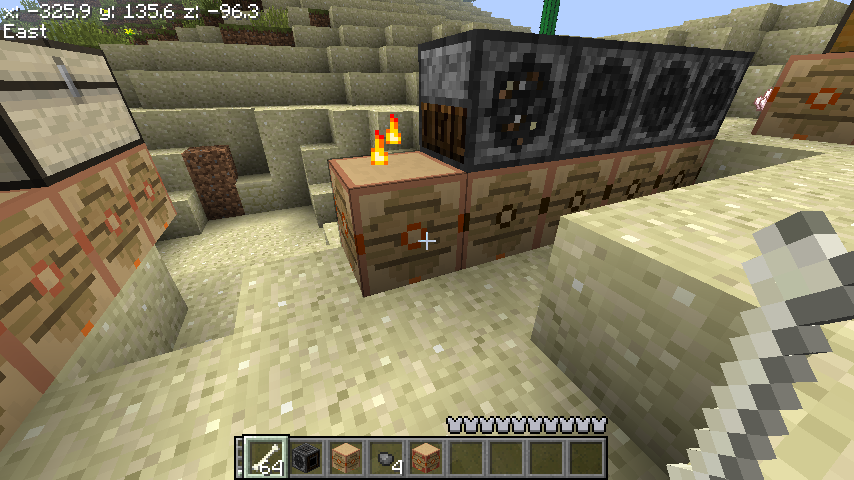
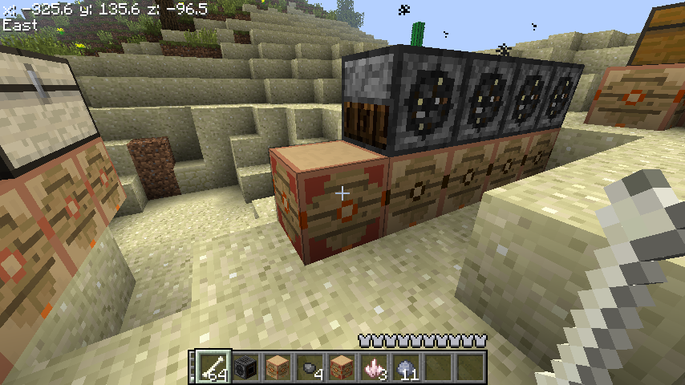

# Ancient Logistics

Ancient Logistics is a mod for [Better than Adventure](https://betterthanadventure.net/) that adds a variety of new items and blocks to the game, all of which are based around the idea of logistics and automation.

### Installation

Requires:
- [Better than Adventure 7.2 Babric Instance](https://github.com/Turnip-Labs/babric-instance-repo/releases/tag/v7.2_01)
- [bta-halplibe v3.1.4](https://github.com/Turnip-Labs/bta-halplibe/releases/tag/3.1.4)

Drop the jar file into the `mods` folder of your Better than Adventure installation.

If there are other mods installed, there may be item or block ID conflicts. If this happens, you can change the IDs in the `config/ancientlogistics.cfg` file.

### Features

#### Gears

These items are used for crafting

#### Gearboxes

These blocks are activated with bones and activate adjacent blocks (in X/Z directions, they do not travel up or down). They occasionally break a bone in your hand, the more strain put on them the more likely it is.

Each Gearbox can only touch one gear block directly at a time and power one adjacent block. If you want to power multiple blocks, you can use a Reinforced Gearbox, which can power many blocks at once (at the cost of additional bones).

#### Trommel Gearbox

This block sits underneath a trommel, and if there are items to seive, this block will activate the trommel without the need for coal.

#### Chest Sorter

This powered block is capable of sorting all chests directly above it. They can be placed next to each other, and will sort all chests in the network. It is crafted using 4 gearboxes, 4 clay, and one chest. Chests are sorted based on distance to the gearbox.

It has been tested and does work with a variety of modded chests, including iron chests.
